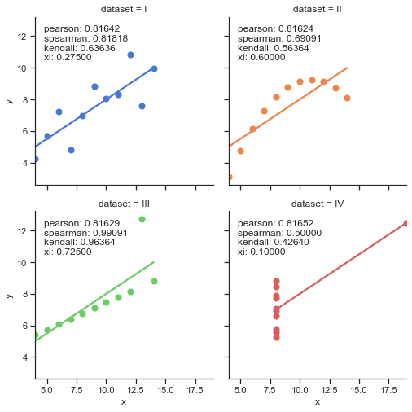

# Summary

Correlation of two vectors in Python can currently be accomplished with Pearson, Spearman, or Kendall metrics. However, breaking ties between equal values is challenging as a large number of ties can skew correlation and make it seem two values are correlated when they are not. A novel coefficient of correlation, Xi ($\Xi$), introduced by @chatterjee2020new, uses a randomized approach to break ties, but is only implemented in the R language. This package brings the novel Xi method of correlation to Python.

# Statement of need

Tie-breaking in correlation computation is a challenging problem. Given two vectors $X$ and $Y$, if multiple pairs of values at positions $i$ and $j$ are equal, e.g. $X_i = Y_i$ and $X_j = Y_j$, how can these values affect the correlation? Tie-breaking is especially challenging for computing correlations in sparse data, where the majority of the values are zero. Thus, there is a high chance that many of the $X_i = Y_i = 0$ pairs are equal. Within the Python ecosystem, the widely used Pearson correlation ([`scipy.stats.pearsonr`](https://docs.scipy.org/doc/scipy/reference/generated/scipy.stats.pearsonr.html?highlight=pearsonr#scipy.stats.pearsonr) doesn't account for ties as it is an exact calculation on the $X$ and $Y$ values. The commonly used Spearman correlation ([`scipy.stats.spearmanr`](https://docs.scipy.org/doc/scipy/reference/generated/scipy.stats.spearmanr.html#scipy.stats.spearmanr)  coefficient, which converts the values to ranks, deal with ties by assigning them the same rank or value. Only the Kendall Tau ($tau$) correlation [`scipy.stats.kendalltau`](https://docs.scipy.org/doc/scipy/reference/generated/scipy.stats.kendalltau.html) can account for ties separately in the $tau_b$ version. The $tau_b$ version accounts for ties by computing the total number of ties in $X$ and $Y$, and are excluded from the correlation coeffieent.

Xi ($Xi$) is a novel coefficient of correlation introduced by @chatterjee2020new. In this coefficient, ties are broken *randomly*, which allows for a more robust calculation of correlation. Below is Anscombe's quartet from @Anscombe1973-mv, a dataset of four pairs of $X$ and $Y$ values designed to have nearly the same linear summary statistics. For each dataset, four different coefficients of correlation are shown: (1) Pearson, (2) Spearman, (3) Kendall, and (4) Xi ($Xi$). Dataset IV is a particularly striking example of the Xi ($\Xi$) metric, as $Xi = 0$ due to the large number of ties, whereas the other correlation metric values are larger. Thus, the Xi ($\Xi$) metric is very useful to distinguish between spurious correlations in largely sparse data with many zeros or ties.

# Python implementation of Xi $\Xi$ correlation

This implementation is based on the [R implementation](https://statweb.stanford.edu/~souravc/xi.R) linked in the paper. Our initial implementation used [pandas](https://pandas.pydata.org/) to perform the rank computation necessary to compute Xi ($\Xi$), however we found this to be slow. Instead, we used [scipy](https://www.scipy.org/) to compute ranks and [numpy](https://numpy.org/) to compute mean and standard deviation, get ordered indices, and random sampling. This resulted in a 10-20x speedup, as shown below.

# Acknowledgements

We acknowledge funding from Chan Zuckerberg Biohub this project.

# References